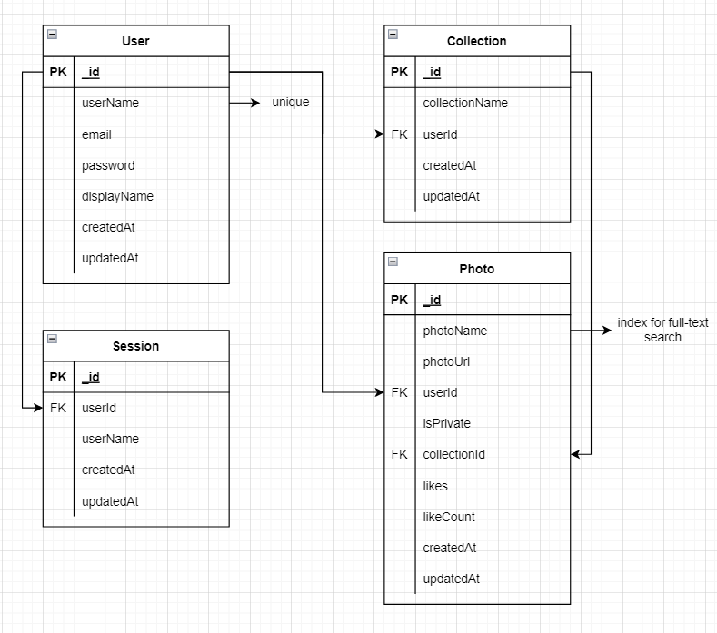

## SUMARY OF PROJECT

### /api/users

| Method | Endpoint         | Description         |
|--------|------------------|---------------------|
| GET    | /:userId         | Get user by id      |
| POST   | /signup          | Sign up new account |
| POST   | /login           | Login               |
| POST   | /new-password    | Forgot password     |
| PATCH  | /change-password | Change password     |
| PUT    | /update          | Update user info    |
| DELETE | /signout         | Sign out            |

### /api/collections

| Method | Endpoint        | Description               |
|--------|-----------------|---------------------------|
| GET    | /:collectionId  | Get collection by id      |
| GET    | /user/:userId   | Get collection by user id |
| POST   | /               | Create new collection     |
| PUT    | /:collectionId  | Update collection         |
| DELETE | /:collectionId  | Delete collection         |


### /api/photos
| Method | Endpoint                                   | Description                      |
|--------|--------------------------------------------|----------------------------------|
| GET    | /user/userId                               | Get photo by user id             |
| GET    | /collection/:collectionId                  | Get photo by collection id       |
| GET    | /:photoId                                  | Get photo by id                  |
| GET    | /[?page=1&limit=10&skip=10&search=keyword] | Get all photo  [by query params] |
| POST   | /                                          | Create new photo                 |
| PUT    | /:photoId                                  | Update photo                     |
| PATCH  | /:photoId/like                             | Trigger like/unlike photo        |
| DELETE | /:photoId                                  | Delete photo                     |

## ERD



## HOW TO CONFIG
- Clone this project
- Create .env file
- Add variables
```
MONGODB_URL_CLOUD
MONGODB_URL_DEV
MONGODB_URL_TEST
PORT
SALT
NODE_ENV
SECRET_KEY
SECRET_KEY_REFRESH
DB_PASSWORD
SERVER_EMAIL
SERVER_EMAIL_PASS
```
- npm i
- npm run dev

<div style="text-align: right"> thanhxuan &copy; 2022 </div>
